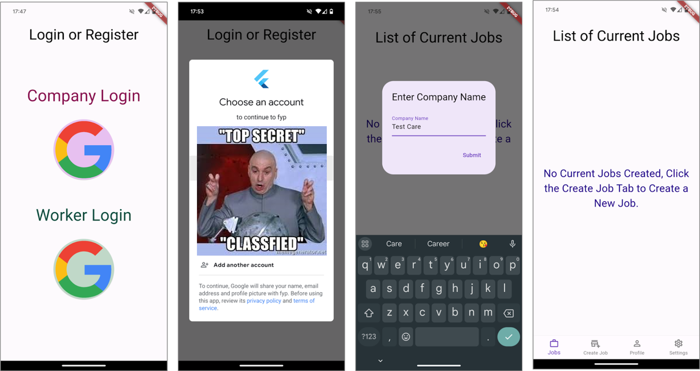
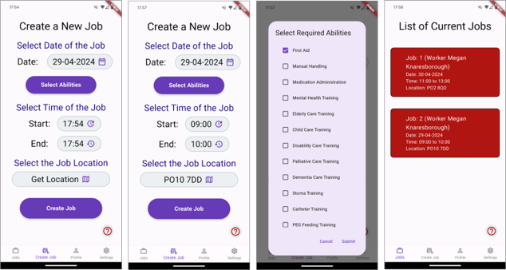
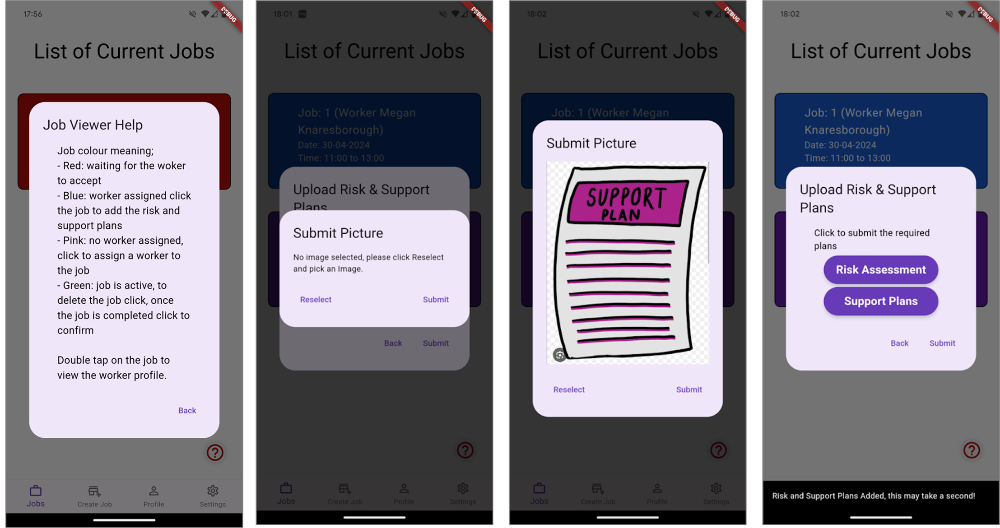
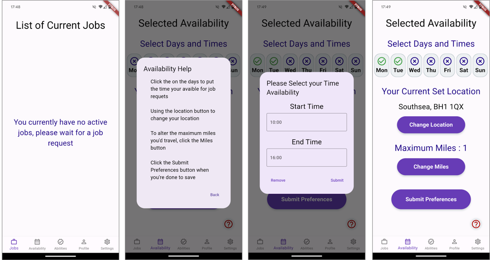
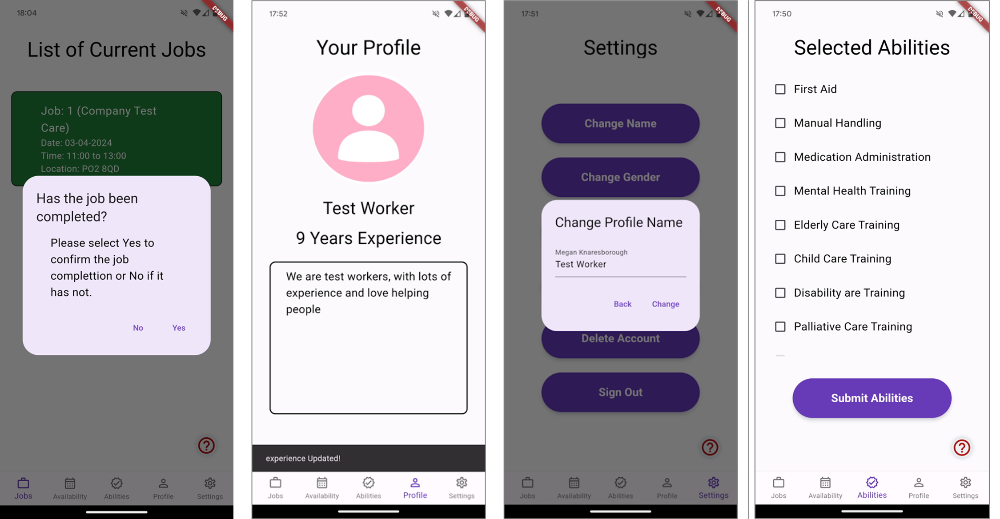

# Locum Healthcare - FYP 2061391

Flutter gig economy application that proposes a potential solution to the current UK healthcare staff shortage crisis. Connects connecting healthcare companies hiring for specific understaffed jobs directly to healthcare workers wanting overtime that fits around their life. 

## Features
- Firebase Real-time Database
  - Authentication
  - Storage

- Login/Register Page

- Worker Navigation Bar
  - Job Management Page: Accept Jobs, Manage current and future job details, View risk assessments/support plans, View Companies
  - Availability Selection Page: Select days, times, and miles available to travel
  - Ability Selection Page: Select abilities trained to do
  - Profile Page: Create profile for companies to view
  - Settings Page: Control account, Edit Profile, Sign-out

- Company Navigation Bar
  - Job Management Page: Delete Jobs, Manage current and future job details, Add risk assessments/support plans, View Workers
  - Job Creation Page: Specify job details to create a job and select matched workers
  - Profile Page: Create profile for workers to view
  - Settings Page: Control account, Edit Profile, Sign-out


## Getting Started

To run this application locally, follow these steps:

### Prerequisites
- Flutter SDK installed
- Android Studio / Visual Studio Code with Flutter extension
- Android Device or Android Emulator
- Android toolchain
### Installation

1. Clone this repository
   ```bash
   git clone https://github.com/unimegan59781/fyp2061391.git
2. Install dependancies
   ```bash
   flutter pub get
3. Run the app on a emulator or android device
   ```bash
   flutter run
4. Enable Location Permissions
(Make sure to enable location permissions on the device where you will run the app)

For Android devices/Emulator:
- Open Settings > Apps > MyApp > Permissions.
- Enable the Location permission.

## Screenshots
Login Screen to Company Side of the App


Company Creates a Job and Selects a Worker


Company View Jobs, Adds Risk Assesments and Support Plans


Worker Side of App, Creates there Avaibility, Change Location and Miles to travel


Worker can Manage Jobs, Alter Profile and Pic their abilities

